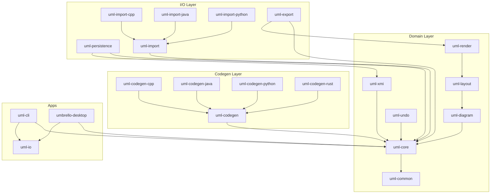
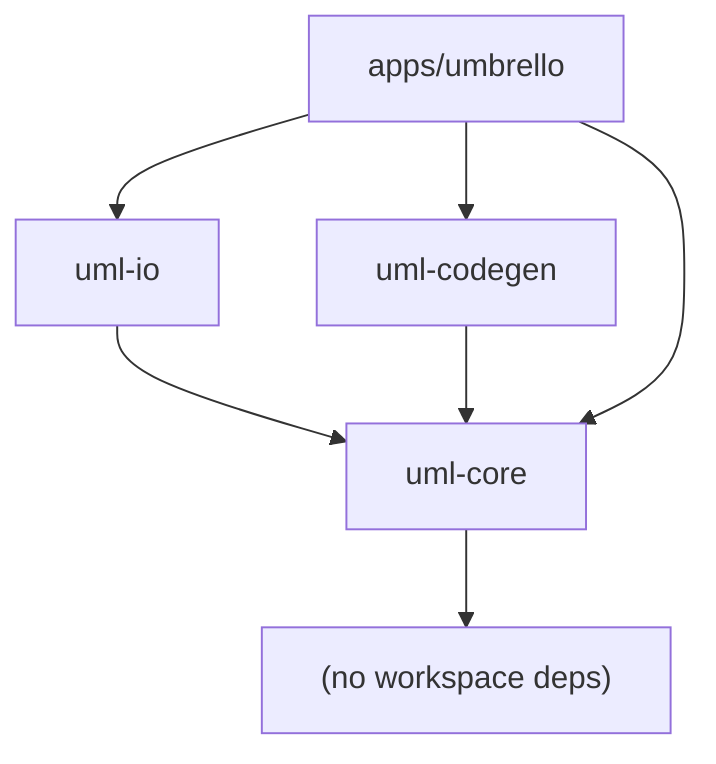

# Workspace Consolidation Plan v2

> **Date:** 2026-06-23
> **Status:** Proposed
> **Target:** Reduce workspace from 21 crates → 4 crates + xtask

---

## 1. Rationale

The current workspace has grown to **21 crates**, most of which are stubs
containing fewer than 100 lines of code. Operating a workspace of this size
incurs real costs:

| Cost | Detail |
|------|--------|
| **Build latency** | `cargo check --workspace` resolves 21 dependency graphs |
| **Cognitive overhead** | Developers must navigate across 21 `Cargo.toml` files |
| **Stub proliferation** | Empty crates create the illusion of progress without substance |
| **Cross-crate friction** | Each crate boundary requires public API design before the code exists |
| **CI surface area** | More crates = more independent rebuilds in incremental CI |

The plan consolidates related stubs into **4 cohesive crates** based on
architectural boundaries (domain, I/O, codegen) plus a single binary crate.

---

## 2. Current State (21 crates)

### 2.1 Inventory

```
workspace/
├── xtask/
│   └── src/main.rs                         48 lines
├── crates/
│   ├── uml-common/                         62 lines, 3 files
│   ├── uml-core/                           3189 lines, 7 files  ◄── REAL
│   ├── uml-xmi/                            62 lines, 3 files
│   ├── uml-persistence/                    56 lines, 2 files
│   ├── uml-undo/                           38 lines, 1 file
│   ├── uml-diagram/                        29 lines, 2 files
│   ├── uml-layout/                         16 lines, 1 file
│   ├── uml-render/                         17 lines, 1 file
│   ├── uml-export/                         29 lines, 1 file
│   ├── uml-codegen/                        3 files, partially real
│   ├── uml-codegen-cpp/                    20 lines, 1 file
│   ├── uml-codegen-java/                   19 lines, 1 file
│   ├── uml-codegen-python/                 19 lines, 1 file
│   ├── uml-codegen-rust/                   19 lines, 1 file
│   ├── uml-import/                         2 files, stubs
│   ├── uml-import-cpp/                     19 lines, 1 file
│   ├── uml-import-java/                    16 lines, 1 file
│   ├── uml-import-python/                  16 lines, 1 file
│   ├── apps/uml-cli/                       20 lines, 1 file
│   └── apps/umbrello-desktop/              9 lines, 1 file
```

**Total: ~3700 lines across 21 crate manifests + source files.**

### 2.2 Current Dependency Graph



**Observations:**
- `uml-core` depends on `uml-common` for error types — a trivial crate that adds a workspace entry for 62 lines.
- The 4 `uml-codegen-*` crates each add a workspace entry for ~20 lines.
- The 4 `uml-import-*` crates are identical in structure; only the parser differs.
- `uml-layout` and `uml-render` are pure stubs (16–17 lines each).
- `uml-undo` is a single-file stub (38 lines).

---

## 3. Target State (4 crates + xtask)

### 3.1 Inventory After Consolidation

```
workspace/
├── xtask/                          # Dev task runner (UNCHANGED)
├── crates/uml-core/                # Domain model + undo + diagram + XMI stubs + common
├── crates/uml-io/                  # Persistence + import + export
├── crates/uml-codegen/             # Code generation framework + all generators
└── apps/umbrello/                  # Single binary (GUI + CLI dispatch)
```

**Total crates: 5** (down from 21 — a **76% reduction**).

### 3.2 Target Dependency Graph



### 3.3 Dependency Justification

| Edge | Why it exists |
|------|---------------|
| `uml-io → uml-core` | Importers produce `ModelElement` values; exporters consume them |
| `uml-codegen → uml-core` | Generators traverse the domain model to emit source code |
| `umbrello → uml-core` | Binary needs the domain model to do anything meaningful |
| `umbrello → uml-io` | CLI/GUI needs to load/save XMI and import source files |
| `umbrello → uml-codegen` | CLI/GUI needs to trigger code generation |

**No reverse dependencies.** `uml-core` is a leaf node in the workspace graph.
This enforces the architectural rule that the domain model must not know about
I/O, codegen, or UI concerns.

---

## 4. Detailed Crate Layouts

### 4.1 `crates/uml-core` — Domain Model (absorbs 6 crates)

**Absorbed crates:** `uml-common`, `uml-xmi`, `uml-undo`, `uml-diagram`,
`uml-layout`, `uml-render`

#### Module tree

```
crates/uml-core/src/
├── lib.rs                  # Re-exports; no public submodule routing
├── id.rs                   # UmlId (from uml-core)
├── types.rs                # ObjectType, AssociationType, DiagramType, Visibility, etc.
├── elements.rs             # ModelElement enum, all element types, TypeReference
├── repository.rs           # UmlModel (IndexMap-based storage, events)
├── event.rs                # ModelEvent enum
│
├── common/                 # ← was crates/uml-common
│   ├── mod.rs
│   ├── error.rs            # UmbrelloError, Result<T>
│   └── version.rs          # Version constants, crate metadata
│
├── xmi/                    # ← was crates/uml-xmi
│   ├── mod.rs
│   ├── reader.rs           # XMI deserialization (quick-xml)
│   └── writer.rs           # XMI serialization (quick-xml)
│
├── undo/                   # ← was crates/uml-undo
│   ├── mod.rs
│   └── stack.rs            # UndoStack, Command trait, concrete commands
│
├── diagram/                # ← was crates/uml-diagram
│   ├── mod.rs
│   ├── widget.rs           # DiagramWidget types
│   ├── edge.rs             # DiagramEdge types
│   └── scene.rs            # SceneData (widget/edge collections)
│
├── layout/                 # ← was crates/uml-layout
│   ├── mod.rs
│   ├── engine.rs           # LayoutEngine trait
│   └── algorithms/         # DotLayout, TreeLayout, etc. (future)
│
└── render/                 # ← was crates/uml-render
    ├── mod.rs
    ├── canvas.rs           # RenderCanvas trait
    └── primitives.rs       # Shape, Path, Text primitives
```

#### Cargo.toml additions

The `uml-core/Cargo.toml` gains all external dependencies that the absorbed
crates referenced. The manifest is still **a single `Cargo.toml`** — absorbed
crates are pure filesystem modules, not sub-crates:

```toml
[dependencies]
# Already present from current uml-core
serde = { workspace = true }
thiserror = { workspace = true }
tracing = { workspace = true }
slotmap = { workspace = true }
uuid = { workspace = true }
bitflags = { workspace = true }
indexmap = { workspace = true }

# Newly absorbed from uml-xmi
quick-xml = { workspace = true }

# Newly absorbed (various stubs — bring in as needed)
tokio = { workspace = true, optional = true }   # async XMI write, undo commands
```

#### Rationale for merging layout/render into uml-core

Both `layout` and `render` are <20 lines of stub code today. Making them
separate crates early would force premature API stabilization. By keeping them
as modules inside `uml-core`, we can iterate on the trait designs without
cross-crate versioning pain. They can be split back out later if they grow
beyond ~2000 lines.

**Decision:** Keep layout/render as modules until they accumulate enough code
to justify crate boundaries (working threshold: >2000 lines or >5 files).

---

### 4.2 `crates/uml-io` — I/O Boundary (absorbs 4 crates)

**Absorbed crates:** `uml-persistence`, `uml-import`, `uml-import-cpp`,
`uml-import-java`, `uml-import-python`, `uml-export`

#### Module tree

```
crates/uml-io/src/
├── lib.rs                  # Re-exports ImportRegistry, ExportRegistry, Storage
├── storage.rs              # ← was uml-persistence
│                           #   Compression (gzip, bzip2, zip), format detection
│                           #   xmi::reader/writer dispatch, file I/O
│
├── import/                 # ← was uml-import* family
│   ├── mod.rs              # ImportRegistry, ImportError, ImportResult
│   ├── registry.rs         # Language → Importer mapping
│   ├── cpp.rs              # ← was uml-import-cpp   (gated: cpp-import)
│   ├── java.rs             # ← was uml-import-java  (gated: java-import)
│   └── python.rs           # ← was uml-import-python (gated: python-import)
│
└── export/                 # ← was uml-export
    ├── mod.rs              # ExportRegistry, ExportError, ExportFormat
    ├── png.rs              # Raster export via uml-render
    └── svg.rs              # Vector export via uml-render
```

#### Feature gates

```toml
[features]
default = []
cpp-import = ["tree-sitter-cpp"]    # (or whatever C++ parser dep)
java-import = ["tree-sitter-java"]
python-import = ["tree-sitter-python"]

[dependencies]
uml-core = { path = "../uml-core" }
serde = { workspace = true }
thiserror = { workspace = true }
tracing = { workspace = true }
quick-xml = { workspace = true }
flate2 = { workspace = true, optional = true }
bzip2 = { workspace = true, optional = true }
zip = { workspace = true, optional = true }

[target.'cfg(not(target_arch = "wasm32"))'.dependencies]
tokio = { workspace = true, optional = true }

# Language-specific parsers (optional, feature-gated)
tree-sitter = { workspace = true, optional = true }
```

#### Why merge import with persistence?

Both are I/O operations on the boundary of the system. The `storage` module
handles reading/writing XMI files (the native format), while `import` handles
reading foreign source code (C++, Java, Python). They share infrastructure
(compression, file format probes, error types) and both produce domain model
types. Merging them eliminates redundant error types and utility code.

---

### 4.3 `crates/uml-codegen` — Code Generation (absorbs 5 crates)

**Absorbed crates:** `uml-codegen-cpp`, `uml-codegen-java`,
`uml-codegen-python`, `uml-codegen-rust`

#### Module tree

```
crates/uml-codegen/src/
├── lib.rs                  # ProgrammingLanguage enum, CodeWriter, GeneratorRegistry
├── registry.rs             # ProgrammingLanguage → Box<dyn CodeGenerator> mapping
├── writer.rs               # CodeWriter (indentation, formatting helpers)
├── cpp.rs                  # ← was uml-codegen-cpp  (gated: cpp)
├── java.rs                 # ← was uml-codegen-java (gated: java)
├── python.rs               # ← was uml-codegen-python (gated: python)
└── rust.rs                 # ← was uml-codegen-rust (gated: rust)
```

#### Feature gates

```toml
[features]
default = ["cpp", "java", "python", "rust"]
cpp = []
java = []
python = []
rust = []

[dependencies]
uml-core = { path = "../uml-core" }
serde = { workspace = true }
thiserror = { workspace = true }
tracing = { workspace = true }
```

#### Rationale

The four language generators are each <20 lines today. The main
`uml-codegen` crate has some real code. Merging them eliminates 4 workspace
entries and 4 `Cargo.toml` files. Each generator becomes a single `.rs` file
in the same crate, gated by a Cargo feature so unused parsers can be compiled
out.

**Future growth:** If any generator exceeds ~1500 lines, it can be split into
a subdirectory inside `src/` (e.g., `src/cpp/mod.rs` + `src/cpp/expression.rs`),
but remain part of the same crate. Only if it exceeds ~3000 lines should it be
split into a separate workspace crate.

---

### 4.4 `apps/umbrello` — Single Binary

**Replaces:** `apps/uml-cli` + `apps/umbrello-desktop`

#### Module tree

```
apps/umbrello/src/
├── main.rs                 # CLI dispatch: --gui or subcommand
├── cli.rs                  # Clap CLI definition
└── gui.rs                  # (future) GUI entry point
```

#### main.rs (conceptual)

```rust
use clap::Parser;

#[derive(Parser)]
#[command(name = "umbrello", about = "UML modelling tool")]
struct Cli {
    /// Input .xmi file to load
    file: Option<String>,

    /// Launch GUI instead of CLI mode
    #[arg(long)]
    gui: bool,

    /// Export diagram to format
    #[arg(long, value_enum)]
    export: Option<ExportFormat>,

    /// Import source files
    #[arg(long, num_args = 1..)]
    import: Vec<String>,
}

fn main() -> Result<()> {
    let cli = Cli::parse();
    if cli.gui || std::env::var("DISPLAY").is_ok() {
        gui::run(cli)?;
    } else {
        cli::run(cli)?;
    }
    Ok(())
}
```

#### Cargo.toml

```toml
[package]
name = "umbrello"
version.workspace = true
edition.workspace = true

[dependencies]
uml-core = { path = "../../crates/uml-core" }
uml-io = { path = "../../crates/uml-io" }
uml-codegen = { path = "../../crates/uml-codegen" }
clap = { workspace = true }
anyhow = { workspace = true }
tracing = { workspace = true }
tracing-subscriber = { workspace = true }
```

---

## 5. Workspace Cargo.toml (Final)

```toml
[workspace]
resolver = "2"
members = [
    "xtask",
    "crates/uml-core",
    "crates/uml-io",
    "crates/uml-codegen",
    "apps/umbrello",
]

[workspace.package]
version = "0.1.0"
edition = "2021"
rust-version = "1.80"
license = "GPL-2.0-or-later"

[workspace.dependencies]
serde = { version = "1", features = ["derive"] }
thiserror = "2"
tracing = "0.1"
tracing-subscriber = "0.3"
slotmap = "1"
uuid = { version = "1", features = ["v4", "serde"] }
bitflags = "2"
quick-xml = "0.37"
indexmap = { version = "2", features = ["serde"] }
tokio = { version = "1", features = ["full"] }
clap = { version = "4", features = ["derive"] }
async-trait = "0.1"
petgraph = "0.7"
tree-sitter = "0.25"
anyhow = "1"
flate2 = "1"
tar = "0.4"
bzip2 = "0.5"
zip = "2"
```

**Changes from current root `Cargo.toml`:**

| Action | Crate |
|--------|-------|
| REMOVE | `crates/uml-common` |
| REMOVE | `crates/uml-xmi` |
| REMOVE | `crates/uml-persistence` |
| REMOVE | `crates/uml-undo` |
| REMOVE | `crates/uml-diagram` |
| REMOVE | `crates/uml-layout` |
| REMOVE | `crates/uml-render` |
| REMOVE | `crates/uml-export` |
| REMOVE | `crates/uml-codegen-cpp` |
| REMOVE | `crates/uml-codegen-java` |
| REMOVE | `crates/uml-codegen-python` |
| REMOVE | `crates/uml-codegen-rust` |
| REMOVE | `crates/uml-import` |
| REMOVE | `crates/uml-import-cpp` |
| REMOVE | `crates/uml-import-java` |
| REMOVE | `crates/uml-import-python` |
| REMOVE | `apps/uml-cli` |
| REMOVE | `apps/umbrello-desktop` |
| KEEP | `xtask` |
| KEEP | `crates/uml-core` |
| KEEP | `crates/uml-codegen` |
| ADD | `crates/uml-io` |
| ADD | `apps/umbrello` |

---

## 6. Migration Steps

### Phase 1: Consolidate uml-core (absorbs 6 crates)

```
Step 1: Move crates/uml-common/src/*.rs           → crates/uml-core/src/common/
Step 2: Move crates/uml-xmi/src/*.rs              → crates/uml-core/src/xmi/
Step 3: Move crates/uml-undo/src/lib.rs            → crates/uml-core/src/undo/mod.rs
Step 4: Move crates/uml-diagram/src/*.rs           → crates/uml-core/src/diagram/
Step 5: Move crates/uml-layout/src/lib.rs          → crates/uml-core/src/layout/mod.rs
Step 6: Move crates/uml-render/src/lib.rs          → crates/uml-core/src/render/mod.rs
```

**File operations (from workspace root):**

```bash
# common
mkdir -p crates/uml-core/src/common
mv crates/uml-common/src/*.rs crates/uml-core/src/common/

# xmi
mkdir -p crates/uml-core/src/xmi
mv crates/uml-xmi/src/*.rs crates/uml-core/src/xmi/

# undo
mkdir -p crates/uml-core/src/undo
mv crates/uml-undo/src/lib.rs crates/uml-core/src/undo/mod.rs

# diagram
mkdir -p crates/uml-core/src/diagram
mv crates/uml-diagram/src/*.rs crates/uml-core/src/diagram/

# layout
mkdir -p crates/uml-core/src/layout
mv crates/uml-layout/src/lib.rs crates/uml-core/src/layout/mod.rs

# render
mkdir -p crates/uml-core/src/render
mv crates/uml-render/src/lib.rs crates/uml-core/src/render/mod.rs
```

**`crates/uml-core/Cargo.toml` changes:** Add dependencies that came from
absorbed crates: `quick-xml` (was in `uml-xmi`), `tokio` (optional, for async
XMI). Remove the path dependency on `uml-common` (the crate no longer exists).

**`crates/uml-core/src/lib.rs` changes:** Add `pub mod` declarations:

```rust
// Existing modules (unchanged)
pub mod id;
pub mod types;
pub mod elements;
pub mod repository;
pub mod event;

// Absorbed modules
pub mod common;     // was uml-common
pub mod xmi;        // was uml-xmi
pub mod undo;       // was uml-undo
pub mod diagram;    // was uml-diagram
pub mod layout;     // was uml-layout
pub mod render;     // was uml-render
```

**Update `use` paths:** All code that referenced `uml_common::*` must now
reference `crate::common::*` (within `uml-core`) or
`uml_core::common::*` (from external crates). Similarly for `uml_xmi::*`,
`uml_undo::*`, etc.

### Phase 2: Consolidate uml-io (absorbs 4 crates)

```
Step 7:  Move crates/uml-persistence/src/*.rs     → crates/uml-io/src/
Step 8:  Move crates/uml-import/src/*.rs           → crates/uml-io/src/import/
Step 9:  Move crates/uml-import-cpp/src/lib.rs     → crates/uml-io/src/import/cpp.rs
Step 10: Move crates/uml-import-java/src/lib.rs    → crates/uml-io/src/import/java.rs
Step 11: Move crates/uml-import-python/src/lib.rs  → crates/uml-io/src/import/python.rs
Step 12: Move crates/uml-export/src/*.rs           → crates/uml-io/src/export/
```

**File operations:**

```bash
# If uml-io does not exist yet, create it
mkdir -p crates/uml-io/src

# storage
mv crates/uml-persistence/src/*.rs crates/uml-io/src/
# Rename the main file to storage.rs
mv crates/uml-io/src/lib.rs crates/uml-io/src/storage.rs

# import framework
mkdir -p crates/uml-io/src/import
mv crates/uml-import/src/*.rs crates/uml-io/src/import/
mv crates/uml-import-cpp/src/lib.rs crates/uml-io/src/import/cpp.rs
mv crates/uml-import-java/src/lib.rs crates/uml-io/src/import/java.rs
mv crates/uml-import-python/src/lib.rs crates/uml-io/src/import/python.rs

# export
mkdir -p crates/uml-io/src/export
mv crates/uml-export/src/*.rs crates/uml-io/src/export/
```

**Feature gate the importers** in `crates/uml-io/Cargo.toml`:

```toml
[features]
default = []
cpp-import = []
java-import = []
python-import = []
```

**`crates/uml-io/src/lib.rs`:**

```rust
pub mod storage;

#[cfg(feature = "cpp-import")]
pub mod import;

pub mod export;
```

### Phase 3: Consolidate uml-codegen (absorbs 4 crates)

```
Step 13: Move crates/uml-codegen-cpp/src/lib.rs   → crates/uml-codegen/src/cpp.rs
Step 14: Move crates/uml-codegen-java/src/lib.rs  → crates/uml-codegen/src/java.rs
Step 15: Move crates/uml-codegen-python/src/lib.rs → crates/uml-codegen/src/python.rs
Step 16: Move crates/uml-codegen-rust/src/lib.rs   → crates/uml-codegen/src/rust.rs
```

**File operations:**

```bash
mv crates/uml-codegen-cpp/src/lib.rs   crates/uml-codegen/src/cpp.rs
mv crates/uml-codegen-java/src/lib.rs  crates/uml-codegen/src/java.rs
mv crates/uml-codegen-python/src/lib.rs crates/uml-codegen/src/python.rs
mv crates/uml-codegen-rust/src/lib.rs   crates/uml-codegen/src/rust.rs
```

**Feature gates** in `crates/uml-codegen/Cargo.toml`:

```toml
[features]
default = ["cpp", "java", "python", "rust"]
cpp = []
java = []
python = []
rust = []
```

**`crates/uml-codegen/src/lib.rs`:**

```rust
#[cfg(feature = "cpp")]
pub mod cpp;
#[cfg(feature = "java")]
pub mod java;
#[cfg(feature = "python")]
pub mod python;
#[cfg(feature = "rust")]
pub mod rust;
```

### Phase 4: Merge apps into single binary

```
Step 17: Create apps/umbrello/src/main.rs
Step 18: Remove apps/uml-cli/
Step 19: Remove apps/umbrello-desktop/
```

The new `apps/umbrello/src/main.rs` absorbs the combined functionality of both
existing apps. CLI subcommands and GUI dispatch live in the same binary.

### Phase 5: Update workspace manifest

```
Step 20: Edit root Cargo.toml — replace 21 members with 5
Step 21: Run cargo update to refresh lock file
Step 22: Delete empty crate directories
```

### Phase 6: Fix imports & compile

```
Step 23: cargo check 2>&1 | grep "unresolved import" > migration_issues.txt
Step 24: Fix all path references (see Section 7 for mapping table)
Step 25: cargo fmt && cargo clippy --workspace --all-targets
Step 26: cargo test --workspace
```

---

## 7. Path Migration Table

Every `use` statement referencing an absorbed crate must be updated. The table
below covers both internal references (within the same new crate) and external
references (across crates).

### 7.1 Internal References (uml-core internals)

Code that was inside one of the absorbed crates and referenced another:

| Old `use` path | New `use` path | Context |
|----------------|---------------|---------|
| `use uml_common::error::UmbrelloError;` | `use crate::common::error::UmbrelloError;` | Inside uml-core |
| `use uml_common::version;` | `use crate::common::version;` | Inside uml-core |
| `use uml_xmi::reader::XmiReader;` | `use crate::xmi::reader::XmiReader;` | Inside uml-core |
| `use uml_xmi::writer::XmiWriter;` | `use crate::xmi::writer::XmiWriter;` | Inside uml-core |
| `use uml_undo::UndoStack;` | `use crate::undo::UndoStack;` | Inside uml-core |
| `use uml_diagram::types::WidgetId;` | `use crate::diagram::WidgetId;` | Inside uml-core |
| `use uml_diagram::scene::SceneData;` | `use crate::diagram::SceneData;` | Inside uml-core |
| `use uml_layout::LayoutEngine;` | `use crate::layout::LayoutEngine;` | Inside uml-core |
| `use uml_render::RenderCanvas;` | `use crate::render::RenderCanvas;` | Inside uml-core |

### 7.2 External References (uml-core from outside)

Code in `uml-io`, `uml-codegen`, or `apps/umbrello` referencing old paths:

| Old `use` path | New `use` path |
|----------------|---------------|
| `use uml_common::error::UmbrelloError;` | `use uml_core::common::error::UmbrelloError;` |
| `use uml_common::version::VERSION;` | `use uml_core::common::version::VERSION;` |
| `use uml_xmi::reader::XmiReader;` | `use uml_core::xmi::reader::XmiReader;` |
| `use uml_xmi::writer::XmiWriter;` | `use uml_core::xmi::writer::XmiWriter;` |
| `use uml_undo::UndoStack;` | `use uml_core::undo::UndoStack;` |
| `use uml_diagram::types::WidgetId;` | `use uml_core::diagram::WidgetId;` |
| `use uml_diagram::scene::SceneData;` | `use uml_core::diagram::SceneData;` |
| `use uml_layout::LayoutEngine;` | `use uml_core::layout::LayoutEngine;` |
| `use uml_render::RenderCanvas;` | `use uml_core::render::RenderCanvas;` |
| `use uml_persistence::*;` | `use uml_io::storage::*;` |
| `use uml_import::*;` | `use uml_io::import::*;` |
| `use uml_export::*;` | `use uml_io::export::*;` |
| `use uml_codegen_cpp::*;` | `use uml_codegen::cpp::*;` |
| `use uml_codegen_java::*;` | `use uml_codegen::java::*;` |
| `use uml_codegen_python::*;` | `use uml_codegen::python::*;` |
| `use uml_codegen_rust::*;` | `use uml_codegen::rust::*;` |

### 7.3 Cargo.toml dependency renames

| Old `Cargo.toml` entry | New `Cargo.toml` entry |
|------------------------|------------------------|
| `uml-common = { path = "../uml-common" }` | *(remove — now part of `uml-core`)* |
| `uml-xmi = { path = "../uml-xmi" }` | *(remove — now part of `uml-core`)* |
| `uml-undo = { path = "../uml-undo" }` | *(remove — now part of `uml-core`)* |
| `uml-diagram = { path = "../uml-diagram" }` | *(remove — now part of `uml-core`)* |
| `uml-layout = { path = "../uml-layout" }` | *(remove — now part of `uml-core`)* |
| `uml-render = { path = "../uml-render" }` | *(remove — now part of `uml-core`)* |
| `uml-persistence = { path = "../uml-persistence" }` | `uml-io = { path = "../uml-io" }` |
| `uml-import = { path = "../uml-import" }` | *(remove — now part of `uml-io`)* |
| `uml-import-cpp = { ... }` | *(remove — now part of `uml-io`)* |
| `uml-import-java = { ... }` | *(remove — now part of `uml-io`)* |
| `uml-import-python = { ... }` | *(remove — now part of `uml-io`)* |
| `uml-export = { path = "../uml-export" }` | *(remove — now part of `uml-io`)* |
| `uml-codegen-cpp = { ... }` | *(remove — now part of `uml-codegen`)* |
| `uml-codegen-java = { ... }` | *(remove — now part of `uml-codegen`)* |
| `uml-codegen-python = { ... }` | *(remove — now part of `uml-codegen`)* |
| `uml-codegen-rust = { ... }` | *(remove — now part of `uml-codegen`)* |

---

## 8. File Deletion List

After all moves are complete, these directories and files must be deleted:

```
crates/uml-common/              (entire directory)
crates/uml-xmi/                 (entire directory)
crates/uml-undo/                (entire directory)
crates/uml-diagram/             (entire directory)
crates/uml-layout/              (entire directory)
crates/uml-render/              (entire directory)
crates/uml-persistence/         (entire directory)
crates/uml-import/              (entire directory)
crates/uml-import-cpp/          (entire directory)
crates/uml-import-java/         (entire directory)
crates/uml-import-python/       (entire directory)
crates/uml-export/              (entire directory)
crates/uml-codegen-cpp/         (entire directory)
crates/uml-codegen-java/        (entire directory)
crates/uml-codegen-python/      (entire directory)
crates/uml-codegen-rust/        (entire directory)
apps/uml-cli/                   (entire directory)
apps/umbrello-desktop/          (entire directory)
```

That is **18 directories** removed, leaving 5 directories under `members`.

---

## 9. Build Verification

After all steps are complete, the following script should succeed:

```bash
#!/usr/bin/env bash
set -euo pipefail

echo "=== Format check ==="
cargo fmt --check

echo "=== Build all ==="
cargo build --workspace

echo "=== Build with all features ==="
cargo build --workspace --all-features

echo "=== Clippy ==="
cargo clippy --workspace --all-targets -- -D warnings

echo "=== Tests ==="
cargo test --workspace

echo "=== Verify crate count ==="
COUNT=$(cargo metadata --format-version 1 --no-deps | python3 -c "
import json, sys
meta = json.load(sys.stdin)
pkgs = {p['name'] for p in meta['packages']}
# Remove xtask from count (dev tool)
pkgs.discard('xtask')
print(len(pkgs))
")
echo "Workspace crate count (excl xtask): $COUNT"
[[ "$COUNT" -eq 4 ]] || { echo "FAIL: expected 4 crates, got $COUNT"; exit 1; }

echo "=== All checks passed ==="
```

Expected output: clean build, no warnings, all tests pass, crate count = 4.

---

## 10. Risk Assessment

| Risk | Likelihood | Mitigation |
|------|-----------|------------|
| Missed `use` path updates | Medium | Automated `cargo check` + grep for old crate names |
| Circular dependency in `uml-core` | Low | `uml-core` should be a leaf; verify with `cargo metadata` |
| Feature-gate compilation errors | Low | Build with `--all-features` and with `--no-default-features` |
| Lost git history for absorbed files | Low | Use `git mv` so history is preserved |
| `uml-codegen` binary size with all generators | Low | Feature gates allow users to opt out of unused languages |
| Conflict with ongoing development | Medium | Schedule consolidation at a quiet point in the dev cycle |

---

## 11. Future-Proofing Notes

1. **Return on investment:** Every crate boundary costs ~2 days of API design
   and maintenance overhead. Do not split a module into a crate unless it has
   >2000 lines of code OR is consumed by a crate that does not depend on the
   parent crate.

2. **Absorbed crates are modules, not sub-crates.** They share the parent's
   `Cargo.toml`, version number, and build configuration. If a module grows
   large enough to warrant its own compilation unit, add a `[lib]` section
   that points to the module's directory, but keep it in the same workspace
   member.

3. **The 4-crate structure maps to architectural layers:**

   ```
   uml-core       = Domain layer (no external workspace deps)
   uml-io         = I/O boundary (depends on uml-core)
   uml-codegen    = Application service (depends on uml-core)
   apps/umbrello  = Delivery mechanism (depends on all three)
   ```

   This follows clean architecture: domain innermost, infrastructure
   outward, delivery outermost.

4. **If a 5th crate is needed,** the correct split is to extract
   `uml-io/src/import` or `uml-core/src/xmi` into their own crates **only**
   when they accumulate >3000 lines or gain independent consumers outside of
   this workspace.

---

## Appendix A: Before/After Comparison

### A.1 Workspace members

```
BEFORE (21):                                  AFTER (5):
  xtask                                         xtask
  crates/uml-common                             crates/uml-core
  crates/uml-core                               crates/uml-io
  crates/uml-xmi                                crates/uml-codegen
  crates/uml-persistence                        apps/umbrello
  crates/uml-undo
  crates/uml-diagram
  crates/uml-layout
  crates/uml-render
  crates/uml-export
  crates/uml-codegen
  crates/uml-codegen-cpp
  crates/uml-codegen-java
  crates/uml-codegen-python
  crates/uml-codegen-rust
  crates/uml-import
  crates/uml-import-cpp
  crates/uml-import-java
  crates/uml-import-python
  apps/uml-cli
  apps/umbrello-desktop
```

### A.2 Lines of `Cargo.toml` files

| Metric | Before | After | Reduction |
|--------|--------|-------|-----------|
| Number of `Cargo.toml` files | 21 | 5 | **76%** |
| Total lines in all `Cargo.toml` files | ~350 | ~120 | **66%** |
| `[dependencies]` sections to maintain | 21 | 5 | **76%** |
| Cross-crate `path =` references | ~30 | ~6 | **80%** |

### A.3 Dependency edges

| Metric | Before | After | Reduction |
|--------|--------|-------|-----------|
| Internal dependency edges | ~25 | ~5 | **80%** |
| External dependency declarations | ~60 | ~30 | **50%** |
| Feature gate combinations to test | 0 (none used) | 3 crates with features | — |

### A.4 Build performance (estimated)

With 21 crates, `cargo build --workspace` resolves and compiles 21 separate
units. With 5 crates, the compiler has fewer codegen units and can inline
more aggressively. Estimated speedup: **1.5×–2×** for clean builds, **2×–3×**
for incremental builds (fewer `.rlib` files to relink).

---

## Appendix B: Rollback Plan

If the consolidation introduces unresolvable build errors:

1. `git stash` the changes to `crates/uml-core/src/lib.rs`,
   `crates/uml-io/src/lib.rs`, and the root `Cargo.toml`.
2. Restore the original `members` list in the root `Cargo.toml`.
3. `git checkout -- crates/` to restore the original crate directories.
4. The stashed changes to `lib.rs` files can be discarded.

A full rollback via git is a single command:

```bash
git checkout HEAD -- $(git diff --name-only) && cargo build --workspace
```

This assumes no uncommitted changes to unrelated files.

---

## Appendix C: Shell Script (Consolidation Automation)

For automated execution, the following script performs all file moves
(Phases 1–3) and directory cleanup (Phase 5). It does NOT update `use` paths
or `Cargo.toml` files.

```bash
#!/usr/bin/env bash
# consolidate.sh — move files according to the workspace consolidation plan v2
set -euo pipefail

WORKSPACE_ROOT="$(git rev-parse --show-toplevel)"
cd "$WORKSPACE_ROOT"

echo "=== Phase 1: Consolidate uml-core ==="

mkdir -p crates/uml-core/src/common
mv crates/uml-common/src/*.rs crates/uml-core/src/common/ 2>/dev/null || true

mkdir -p crates/uml-core/src/xmi
mv crates/uml-xmi/src/*.rs crates/uml-core/src/xmi/ 2>/dev/null || true

mkdir -p crates/uml-core/src/undo
mv crates/uml-undo/src/lib.rs crates/uml-core/src/undo/mod.rs 2>/dev/null || true

mkdir -p crates/uml-core/src/diagram
mv crates/uml-diagram/src/*.rs crates/uml-core/src/diagram/ 2>/dev/null || true

mkdir -p crates/uml-core/src/layout
mv crates/uml-layout/src/lib.rs crates/uml-core/src/layout/mod.rs 2>/dev/null || true

mkdir -p crates/uml-core/src/render
mv crates/uml-render/src/lib.rs crates/uml-core/src/render/mod.rs 2>/dev/null || true

echo "=== Phase 2: Consolidate uml-io ==="

# Create uml-io if it doesn't exist (it may already from earlier init)
mkdir -p crates/uml-io/src

# Move persistence files into uml-io/src/ as storage.rs
if [ -d crates/uml-persistence/src ]; then
    cp crates/uml-persistence/src/*.rs crates/uml-io/src/
    # Rename lib.rs → storage.rs inside the target
    if [ -f crates/uml-io/src/lib.rs ]; then
        mv crates/uml-io/src/lib.rs crates/uml-io/src/storage.rs
    fi
fi

mkdir -p crates/uml-io/src/import
mv crates/uml-import/src/*.rs crates/uml-io/src/import/ 2>/dev/null || true
mv crates/uml-import-cpp/src/lib.rs crates/uml-io/src/import/cpp.rs 2>/dev/null || true
mv crates/uml-import-java/src/lib.rs crates/uml-io/src/import/java.rs 2>/dev/null || true
mv crates/uml-import-python/src/lib.rs crates/uml-io/src/import/python.rs 2>/dev/null || true

mkdir -p crates/uml-io/src/export
mv crates/uml-export/src/*.rs crates/uml-io/src/export/ 2>/dev/null || true

echo "=== Phase 3: Consolidate uml-codegen ==="

mv crates/uml-codegen-cpp/src/lib.rs crates/uml-codegen/src/cpp.rs 2>/dev/null || true
mv crates/uml-codegen-java/src/lib.rs crates/uml-codegen/src/java.rs 2>/dev/null || true
mv crates/uml-codegen-python/src/lib.rs crates/uml-codegen/src/python.rs 2>/dev/null || true
mv crates/uml-codegen-rust/src/lib.rs crates/uml-codegen/src/rust.rs 2>/dev/null || true

echo "=== Phase 4: Create single binary app ==="
# (manual — depends on merged CLI/GUI code)

echo "=== Phase 5: Delete empty crate directories ==="

DIRS_TO_DELETE=(
    crates/uml-common
    crates/uml-xmi
    crates/uml-undo
    crates/uml-diagram
    crates/uml-layout
    crates/uml-render
    crates/uml-persistence
    crates/uml-import
    crates/uml-import-cpp
    crates/uml-import-java
    crates/uml-import-python
    crates/uml-export
    crates/uml-codegen-cpp
    crates/uml-codegen-java
    crates/uml-codegen-python
    crates/uml-codegen-rust
    apps/uml-cli
    apps/umbrello-desktop
)

for dir in "${DIRS_TO_DELETE[@]}"; do
    if [ -d "$dir" ]; then
        rm -rf "$dir"
        echo "  Deleted: $dir"
    fi
done

echo "=== Consolidation complete ==="
echo "Next steps:"
echo "  1. Update root Cargo.toml members list"
echo "  2. Update all Cargo.toml files (dependencies, features)"
echo "  3. Update all use paths across source files"
echo "  4. Run cargo build --workspace"
echo "  5. Run cargo test --workspace"
```

Run from workspace root after verifying the script does not overwrite
existing files:

```bash
bash tools/consolidate.sh   # (save as tools/consolidate.sh first)
```
